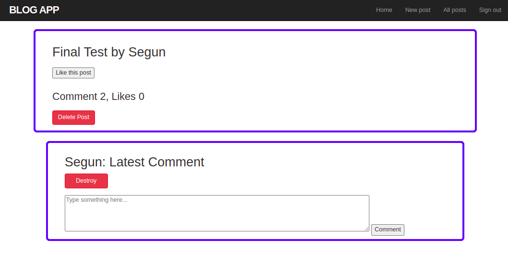
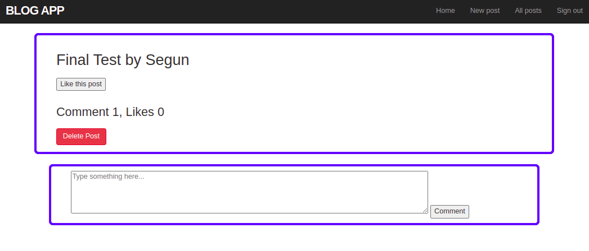

# Blog-App

> The Blog app will be a classic example of a blog website. You will create a fully functional website that will show the list of posts and empower readers to interact with them by adding comments and liking posts.


## Milestone Image
Project Img1   |  Project Img2
:-------------------------:|:-------------------------:
 | 

## Built With

- Ruby on Rails

## To get a local copy run the following steps:
- Copy this link [this link](https://github.com/Whoistolu/blog-app)
- Open your terminal or command line
- Run "git clone Paste [this link](https://github.com/Whoistolu/blog-app)"
- Open the folder with your code editor
- Create a branch to work on
- Or open the `` file in the dist directory to start coding

Run:
````
bundle install
````

Run:
````
rails s
````


👤 **Author1**

- Name: **Ajise Toluwase**
- GitHub: [@githubhandle](https://github.com/Whoistolu)
- Twitter: [@twitterhandle](https://twitter.com/Littletolu)
- LinkedIn: [LinkedIn](https://www.linkedin.com/in/toluwase-ajise-9b40411b2/)

👤 **Author2**

- Name:  **Moises Hernandez Coronado**
- GitHub: [@Mhdez221993](https://github.com/Mhdez221993)
- Twitter: [@MoisesH42060050](https://twitter.com/MoisesH42060050)
- LinkedIn: [Moises Hernandez Coronado](https://www.linkedin.com/in/moises-hernandez-9bbb17145/)


👤 **Author3**

:bearded_person: **Hector**
  - GitHub: [@githubhandle](https://github.com/Hector096)
  - Linkedin: [@linkedinhandle](https://www.linkedin.com/in/hector096/)

## 🤝 Contributing

Contributions, issues, and feature requests are welcome!

Feel free to check the [issues page](https://github.com/Whoistolu/blog-app/issues).


## Acknowledgements

## Show your support

Give a ⭐️ if you like this project!
